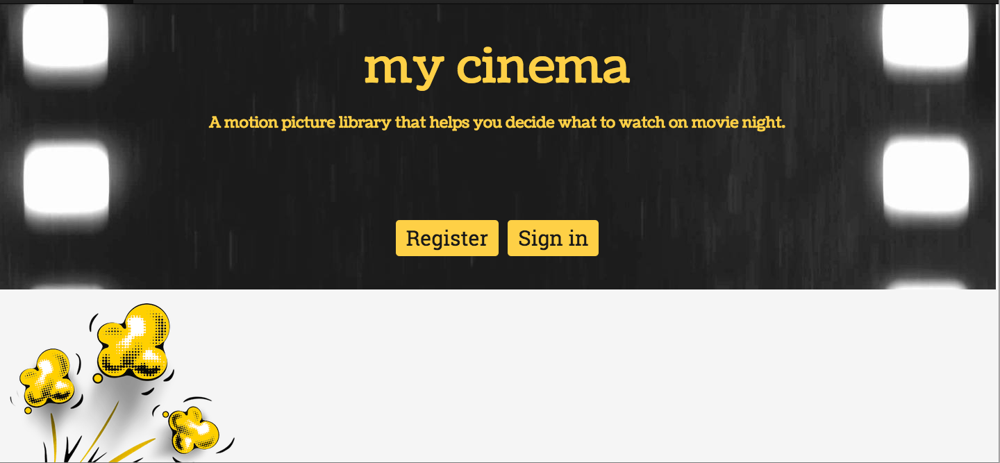
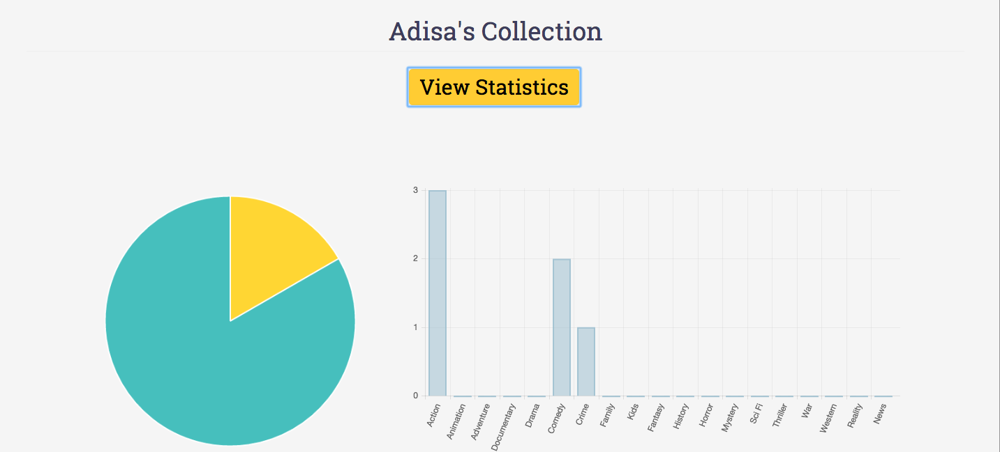
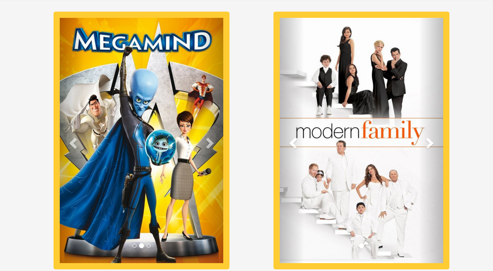

<h1> my cinema</h1>

Because there are so many movies out there for us to watch today, it becomes quite difficult to decide which one to watch. The movie-selector app essentially helps you choose what to watch based on a number of predefined criterias you can choose from such as year, director, genre and more. The application utilizes the Open Movie Database API (http://tmdb.org) to retrieve information about movies, the summarary, rating and actors. The application could possibly have the functionality of providing how to watch the movie whether it's through Hulu, Netflix, Amazon Prime or other online services. MongoBD is used to store the movies that the user selects to watch and user can also choose to add the movies that wish to watch in the future. 

Images of movie posters will be retrieved using the API.
Please see documentation directory for more information about the design and detail of the project.

<h2> Homepage </h2>

<h2> User Stats Page </h2>

<h2> Collection Page </h2>

