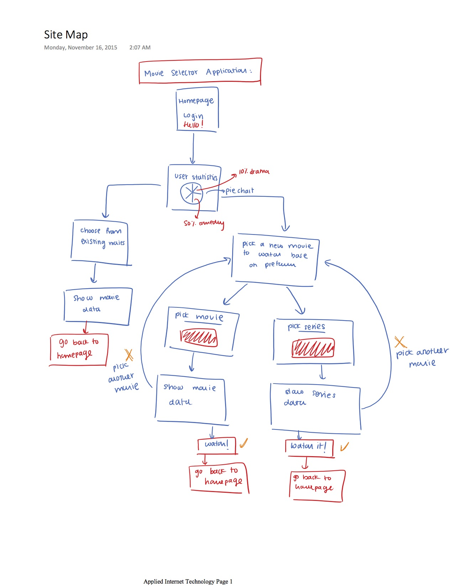

<h1> my cinema</h1>

Because there are so many movies out there for us to watch today, it becomes quite difficult to decide which one to watch. The movie-selector app essentially helps you choose what to watch based on a number of predefined criterias you can choose from such as year, director, genre and more. The application utilizes the Open Movie Database API (http://omdbapi.com) to retrieve information about movies, the summarary, rating and actors. The application could possibly have the functionality of providing how to watch the movie whether it's through Hulu, Netflix, Amazon Prime or other online services. MongoBD is used to store the movies that the user selects to watch and user can also choose to add the movies that wish to watch in the future. 

The project was inspired by my family's favorite way to spend our free time together. We watch movies on Sunday nights and deciding what to watch isn't an easy process. 

Images of movie posters will be retrieved using the API.
Please see documentation directory for more information about the design and detail of the project.

<h2> Homepage </h2>

<h2> User Stats Page </h2>

<h2> Collection Page </h2>

<h1> Project Documentation </h1> 

<h2> JSON Description </h2>

Movie Database in MongoDB
  * movie collection
  * series collection
  * user collection

Movie Schema:
* Each movie document contains information about a specific movie including its title, year, etc.
* Users can add movies they would like to watch or when the selector chooses a movie for the user
* based on their preference (year, director, top 250 movies), they can add it to the list of movies they would like to watch.

var Movie = new mongoose.Schema() {

    title:String,
    year:String,
    direction:String,
    tagline: String,
    rating: Number
    funFact: String
}

Series Schema - Similar to movie document but contains information about a specific series

var Series = new mongoose.Schema() {

    title:String,
    year:String,
    numOfSeasons: String,
    tagline: String,
    rating: Number
    funFact: String
}

User Schema
* Contains information about the user that is using the website and their movies and series preferences

var User = new mongoose.Schema() {

    name:String,
    password: String,
    age:String,
    statistics: Stats,
    email: String,
    movies:[Movie],
    series: [Series]
}

Stats schema:
* Keeps track of user statistics, which includes the total number of items that they have selected to watch, whether this item is movie or tv-series. 
* Statistics is also kept on which genre the user chooses to watch the most.

var Stats = new mongoose.Schema() {

    total: Number,
    movies: Number,
    tvseries: Number,
    Documentary: Number,
    Action: Number,
    Drama: Number,
    //other genres
}

<h2> Site Map </h2>

<h2> Wireframe </h2>

<h2> Research</h2>

<h3> Modules and concepts to research: </h3>

<h4> List of research topics </h4> 

	* External API 
	* Open Movie Database (http://www.omdbapi.com)(3 points)
	* Rotten Tomato API

		What is it? : 
		The OMDb API is a free web service to obtain movie information, all content and images on the site are contributed and maintained by the users.
		Why use it : 
		API to obtain information about movies that user would potentially like to watch. 
		Rotten Tomato API: Would use it to obtain rating of the movie 

	* Integrate user authentication. Implement sign up and registration (Google, FB, etc.)

		* What is it? : Login / Signup page for user to log onto the web application. Possibly allow user to sign up through Facebook, Google, Twitter, etc. Allow users to post on these sites about what movies they're watching or would like to watch

		* Why use it : 
			Allows the site to identify users / retrieve information about the user to display their 
			data and saved movies 
		* How? / Tools :
			Facebook, Google API / User authentication slides 
	
	* Using data visualization tool to present the user with statistics about their choices

		* What is it? : Data visualization tool to show user their choices and preference and encourage them to try watching new things! 

		* Why use it : So that users can see their top preferences and encourages them to explore genres and watch different movies. 
		
		* Tool: D3 - a possibility 
	
	* Bootstrap (maybe)

		What is it: 
			* CSS, HTML and Javascript framework. 
		Why use it: 
			* I'm really not a big fan of styling my CSS. 
		Tools: 
			* Bootstrap 

<h2> Use Cases </h2> 
* As a user I want to watch a movie. 
* There are to many movies to choose from. 
* As a user I want the web application to help me decide what to watch.
* As a user I want to see the information about the movie I'm going to watch. 
* As a user I want the web application to show me statistics of the types of movies I choose to watch. 
* As a user I want to save movies to watch in the future.

[Images!](documentation/Images)

